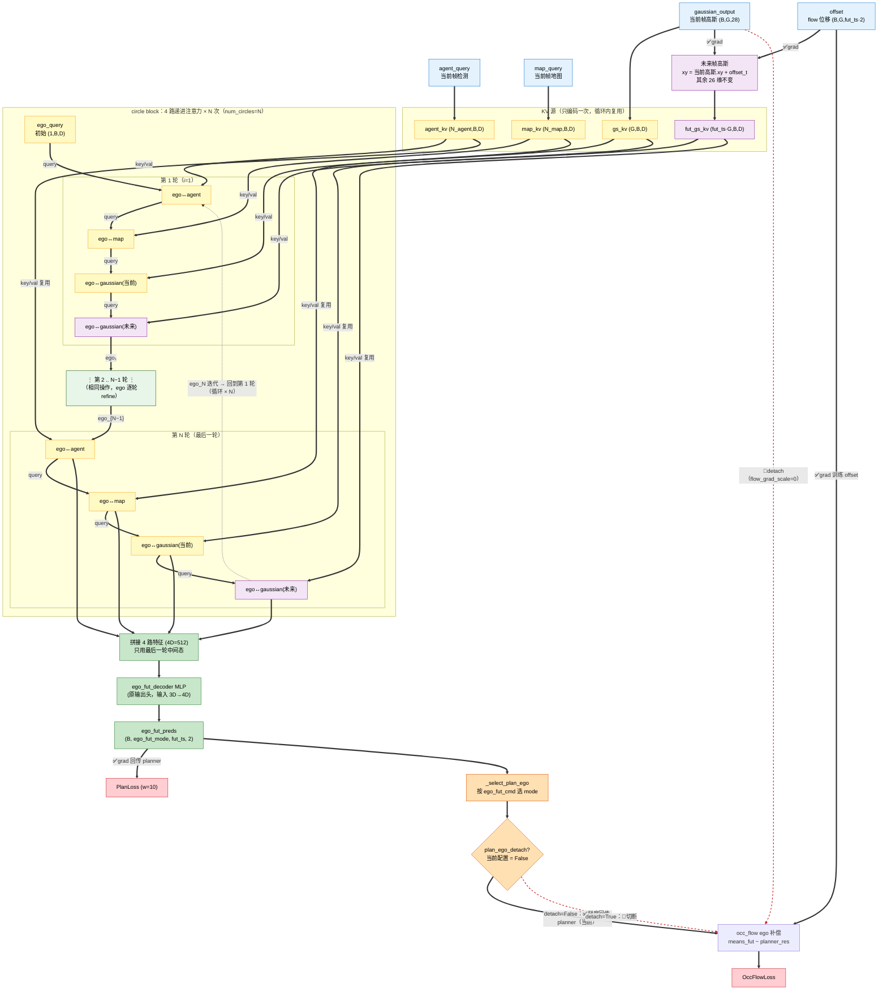
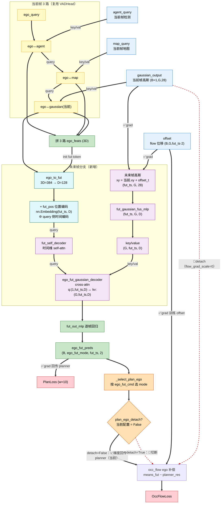
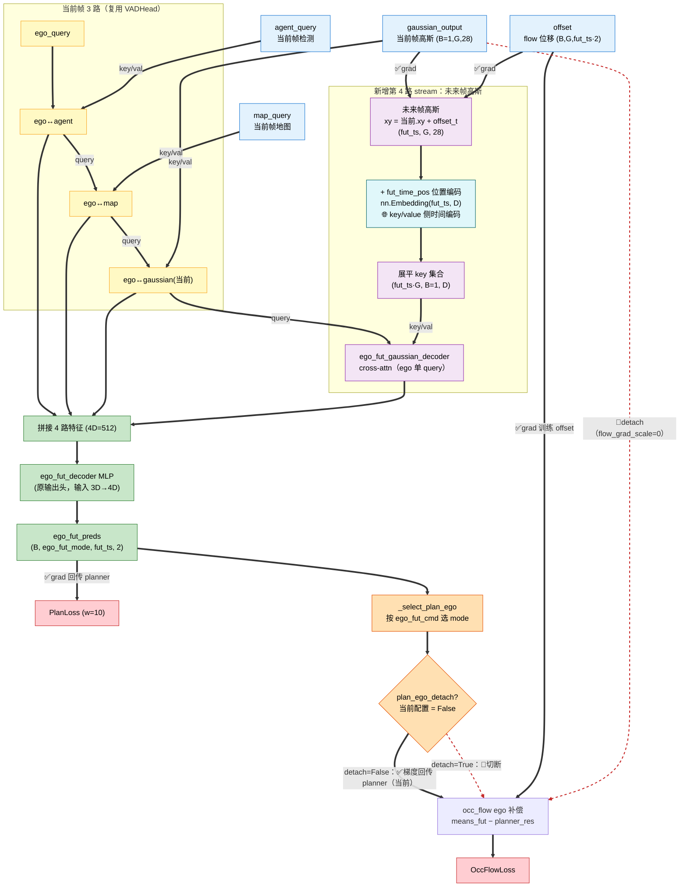
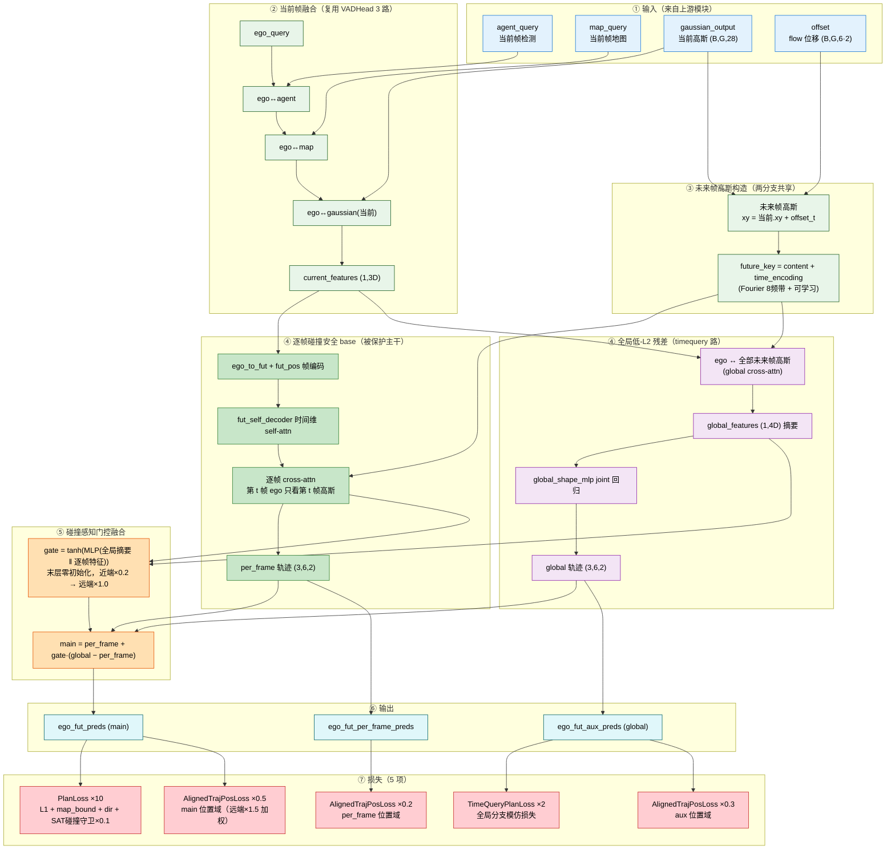

# GaussianAD

## Circle Planner 架构（VADHeadCircleGaussian, planner_v5）

把「ego↔agent → ego↔map → ego↔gaussian(当前) → ego↔gaussian(未来)」这条 4 路递进交叉注意力封装成一个 block，循环 `num_circles` 次（recurrent refinement）：每轮用上一轮融合后的 ego 重新再看一遍 4 路信息，逐轮迭代收敛，实现信息充分融合，重点改善碰撞率 (obj_box_col)。

---

## Planner A：FutAttn（VADHeadFutAttn, planner_v2）

配置文件：`config/nuscenes_gs25600_gtbox_oracle_v12_ft_plan_futattn/`（base: `v12_ft_plan`）

保留**当前帧 3 路**（与 `VADHead` 完全一致，结构/权重不变），新增**未来帧分支**：

- 未来帧高斯 = 当前高斯 xy + offset 逐帧平移（与 `gaussian_head.forward_flow` 的 `means_fut = means + offset` 一致，batch=1）；
- 未来 ego token：当前帧融合特征 (3D) 经 `ego_to_fut` 投影 + **逐帧位置编码 `fut_pos` (query 侧)**；
- 先 `fut_self_decoder` 做时间维 self-attention（建模 6 帧时序连贯性）；
- 再 `ego_fut_gaussian_decoder` 逐帧交叉注意力（frames 折叠进 batch 维：query `(1,fut_ts,D)` ↔ key/val `(G,fut_ts,D)`，第 t 帧 ego 只看第 t 帧高斯）；
- 逐时间步回归 `fut_out_mlp` → `(B, ego_fut_mode, fut_ts, 2)`。

---

## Planner B：FutGauTime（VADHeadFutGaussianTime, planner_v4）

配置文件：`config/nuscenes_gs25600_gtbox_oracle_v12_futgau_costime/`（base: `base_plan`，对照 `futgau_detach_false`）

与 FutAttn 的设计路线不同：**不新建未来 ego token**，而是把**未来帧高斯**作为与 agent/map/当前高斯完全对称的**第 4 路 stream** 融合：

- 未来帧高斯 = 当前高斯 xy + offset 逐帧平移，6 帧展平为一个 key 集合 `(fut_ts·G, D)`（batch=1 折叠）；
- ego 单 query 与展平的未来高斯做一次交叉注意力（`ego_fut_gaussian_decoder`）；
- **逐时间步位置编码 `fut_time_pos` 加在 key/value 侧**（即高斯特征上），使每个 key 明确携带「属于未来第几帧」；
- 拼接 4 路特征 (4D=512) → 复用原 `ego_fut_decoder`（输入 3D→4D 加宽）回归轨迹。

---

---

## 两个 Planner 的时间编码区别

|                  | **Planner A：FutAttn** (planner_v2)                                                      | **Planner B：FutGauTime** (planner_v4)                                     |
| ---------------- | ---------------------------------------------------------------------------------------- | -------------------------------------------------------------------------- |
| 配置文件         | `v12_ft_plan_futattn`                                                                    | `v12_futgau_costime`                                                       |
| 时间编码位置     | **query 侧**（未来 ego token）                                                           | **key/value 侧**（未来帧高斯）                                             |
| 实现             | `fut_pos = nn.Embedding(fut_ts, D)`，加到未来 ego token 逐帧                             | `fut_time_pos = nn.Embedding(fut_ts, D)`，加到未来高斯 `(fut_ts,G,D)` 逐帧 |
| 未来帧组织形式   | 帧折叠进**batch 维**：q `(1,fut_ts,D)` ↔ kv `(G,fut_ts,D)`，第 t 帧 ego 只看第 t 帧高斯 | 帧+高斯**展平**成一个 key 集合 `(fut_ts·G, B, D)`，ego 单 query 看全部    |
| 时序建模         | `fut_self_decoder`（时间维 self-attn）+ `fut_pos` PE                                     | 无 self-attn，仅靠 key 侧 PE + offset 坐标                                 |
| 输出头           | 新分支`fut_out_mlp` **逐时间步回归**（替换原头）                                         | 复用原`ego_fut_decoder`（3D→4D 加宽）                                     |
| 已知取舍         | 3D→D 压缩瓶颈；新头从零学                                                               | 保留预训练输出头作 baseline；注意力无帧隔离                                |
| 无时间编码的对照 | —                                                                                       | `futgau_detach_false`（v3 展平后无任何 PE）                                |

> 简言之：**FutAttn 把时间编码放在「问的一方」（ego query），配合帧间 self-attn 让轨迹回归逐帧感知时刻**；**FutGauTime 把时间编码放在「被看的一方」（未来高斯 key），让展平的未来场景本身携带帧序信息**。两者都从 `v12_fixempty epoch_15` 续训、`plan_ego_detach=False`（occ_flow 梯度可回传 planner）。

---

## Planner C：FutAttnGlobalResidual（VADHeadFutAttnGlobalResidual, planner_v12）

配置文件：`config/nuscenes_gs25600_gtbox_oracle_v12_ft_plan_futattn_global_residual/`（base: `v12_ft_plan`）

**融合策略**（翻转 timequery 的融合方向）：以 futattn 的**逐帧碰撞安全路为被保护的主干 base**，把 timequery 的**全局低-L2 路当作门控残差**：

$$\text{main} = \text{per\_frame} + \text{gate} \cdot (\text{global} - \text{per\_frame})$$

- **per_frame**（绿）：完全复用 futattn 逐帧 cross-attn（碰撞安全基座），门未开时（gate=0）main 严格等于 per_frame；
- **global**（紫）：ego 对所有未来帧高斯 attn + joint MLP（低 L2）；
- **gate**（橙）：逐样本逐帧输入相关门，末层零初始化 `tanh(0)=0`，同时看「全局摘要(4D) + 逐帧接地特征(D)」，近端时间乘系数 0.2、远端 1.0 → 近端压门保碰撞、远端开门拉 L2。

**评测结果（epoch_15，L2↓ / 碰撞↓）**：L2 1s 0.4305 / 2s 0.7775 / 3s 1.2156（全项最优），obj_box_col 1s 0.0071 / 2s 0.0096 / 3s 0.0130（全项最优）——同时拿下 L2 与碰撞率双第一，打破"L2 与碰撞不可兼得"的权衡。
