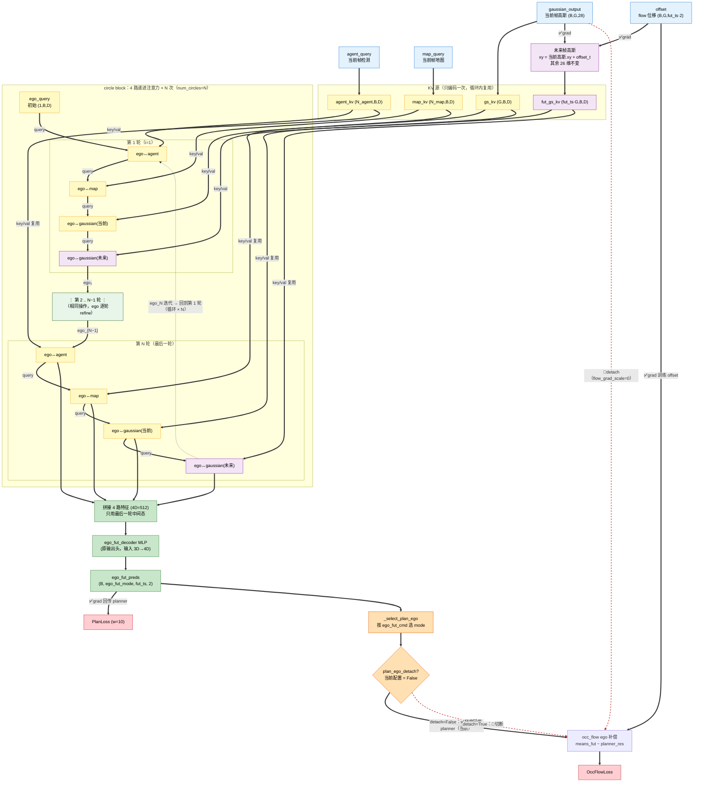

# GaussianAD

## Circle Planner 架构（VADHeadCircleGaussian, planner_v5）

把「ego↔agent → ego↔map → ego↔gaussian(当前) → ego↔gaussian(未来)」这条 4 路递进交叉注意力封装成一个 block，循环 `num_circles` 次（recurrent refinement）：每轮用上一轮融合后的 ego 重新再看一遍 4 路信息，逐轮迭代收敛，实现信息充分融合，重点改善碰撞率 (obj_box_col)。

