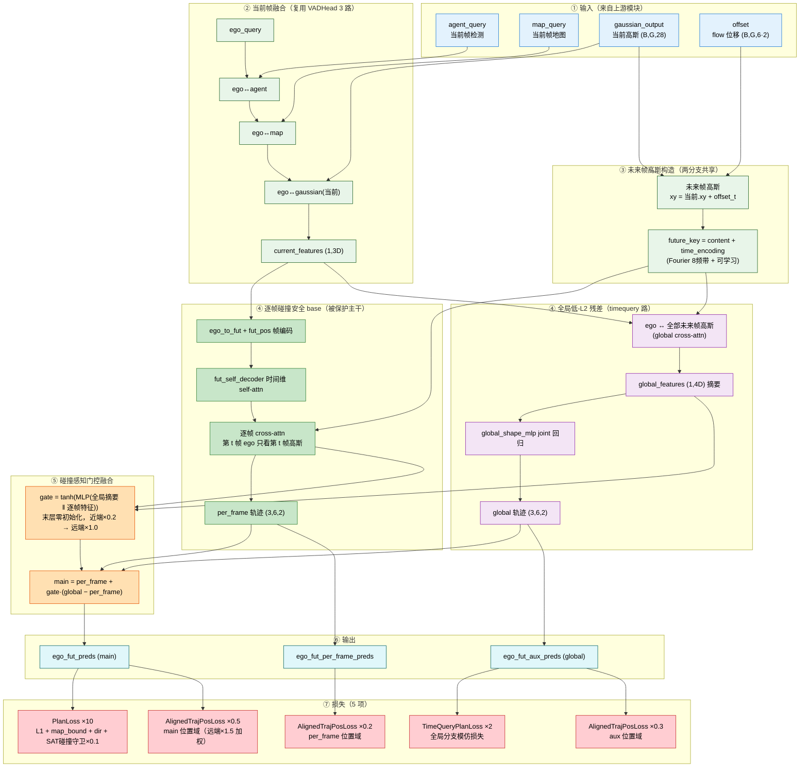

# GaussianAD — Planner 设计演进与实验结果

本文档阐述本仓库 planner（规划头）的设计演进脉络：从基线 `VADHead` 出发，经过多轮引入"未来帧高斯"信息的改造，最终收敛到**融合逐帧碰撞安全与全局低-L2 的门控残差架构 `VADHeadFutAttnGlobalResidual`（planner_v12）**，并给出各变体在 NuScenes 验证集上的规划与占据结果。

---

## 一、设计动机：为什么 planner 需要"未来帧高斯"

原始 `VADHead`（`model/planner/planner.py`）的规划流程是：让 ego query 依次与当前帧的 agent / map / gaussian 三路信息做交叉注意力，拼接成 3D 特征后用 MLP 一次性回归整条未来 6 帧轨迹。这条路线的问题在于：**planner 看不到"未来场景会怎么动"**——未来帧高斯的运动信息（由 temporal encoder 输出的 `offset` flow 位移给出）没有直接参与规划决策。

本项目里未来帧高斯并非重新预测，而是把当前帧高斯按预测位移平移得到（`means_fut = means + offset`，与 `gaussian_head.forward_flow` 同约定）。让未来帧信息进入 planner 的两种互补思路，构成了后续所有变体的两条主线：

- **逐帧路线（碰撞安全）**：ego 逐未来时间步、只与该时刻的未来高斯做交叉注意力，每个 waypoint 都锚定在本帧占据上，碰撞率优秀；
- **全局路线（低 L2）**：ego 一次性对全部未来帧高斯做注意力，联合回归整条轨迹形状，轨迹精度（L2）优秀。

---

## 二、设计演进：五轮改造

### 1. VAD_Planner（接入 planning 的头）

在三维感知（检测 / 占据 / 流）之上首次接入规划头，ego 与当前帧 agent / map / gaussian 交互后回归未来轨迹，作为后续所有实验的基线起点。

### 2. VAD_Planner + Future Gaussian（未来帧高斯第 4 路，planner_v3 `VADHeadFutGaussian`）

把未来帧高斯作为与 agent / map / 当前高斯完全对称的**第 4 路 stream** 融合：未来帧高斯展平成一个 key 集合 `(fut_ts·G, B, D)`，ego 单 query 与全部未来帧高斯做一次交叉注意力，拼接 4D 特征后复用原 `ego_fut_decoder`（输入 3D→4D 加宽）回归轨迹。

设计上保留预训练输出头作基线，属于"增广"而非"替换"；但 key 集合展平后**没有任何时间编码**，模型无法显式区分"这是未来第几帧"。

### 3. futgau_detach_false_time（key 侧时间编码，planner_v4 `VADHeadFutGaussianTime`）

在 v3 基础上做最小改动：给未来帧高斯特征按时间步加上**可学习时间位置编码 `fut_time_pos = nn.Embedding(fut_ts, D)`**，加在 **key/value 侧（高斯特征上）**，使展平后的每个 key 明确携带帧序信息。这是第一版显式引入时间编码的 planner。

### 4. timequery_residual（全局路为主干，planner_v10 `VADHeadTimeQueryResidual`）

把"全局路"作为主干、"逐帧路"作为残差（`main = global + gate·(per_frame − global)`），并引入**连续 Fourier 时间编码**（多个频带 × 2π·t 相位 + 可学习 Embedding + LayerNorm 融合），对未来帧高斯 key 做更精细的时间建模。该变体拿到最优 L2，但由于主干不是逐帧接地，碰撞率全场最差（0.0201@3s）——**L2 与碰撞不可兼得的典型体现**。

### 5. futattn_global_residual（逐帧路为 base + 全局门控残差，planner_v12，最终版）

**翻转 timequery 的融合方向**，把"逐帧碰撞安全路"作为被保护的主干 base，把"全局低-L2 路"当作门控残差：

$$ \text{main} = \text{per\_frame} + \text{gate} \cdot (\text{global} - \text{per\_frame}) $$

- **per_frame（逐帧 base）**：完全复用 futattn 的逐帧 cross-attn 路——ego 逐未来帧只与该帧未来高斯交互，第 t 帧只看第 t 帧。门未开时（`gate=0`）main 严格等于 per_frame，保证训练起始即碰撞安全。
- **global（全局残差）**：ego 对所有未来帧高斯（带 Fourier+可学习时间编码的 key）做交叉注意力，拼接 4D 全局摘要特征后由 `global_shape_mlp` joint 回归整条轨迹，负责低 L2。
- **gate（碰撞感知融合门）**：逐样本、逐时间步、输入相关的门，`gate = tanh(MLP(global 摘要 ‖ per_frame 接地特征))`，**末层零初始化**（`tanh(0)=0` → 初始 main == per_frame）；再乘时间系数 `time_scale`（近端 0.2 → 远端 1.0），实现"近端压门保碰撞、远端开门拉 L2"。

三条输出分别暴露：`ego_fut_preds`（融合主线）、`ego_fut_aux_preds`（全局分支）、`ego_fut_per_frame_preds`（逐帧基座）。全局分支配独立模仿损失，避免 zero-gate 饿死残差分支的 dead-gate 失效。

---

## 三、损失函数

`futattn_global_residual` 的训练由五类损失共同驱动（`loss/plan_loss.py`），其中前两类继承自 `ft_plan` 基础配置，后三类为本次新加的定位/形状约束：

1. **PlanLoss（外层 ×10）**：作用在融合主线 `ego_fut_preds` 上，内部由三部分构成——**L1 位移回归**（对 GT 轨迹做逐模态加权 L1）、**PlanMapBoundLoss**（把 self 推出车道边界，距离小于阈值即惩罚、并做线段相交遮罩）、**PlanMapDirectionLoss**（让 self 朝向与车道线方向一致）。另在 `col_sat=True` 时叠加 **SAT 碰撞守卫（内层 ×0.1，有效权重 10×0.1=1.0）**：把 self 与每个 GT 车辆都建模成朝向敏感的矩形，用分离轴定理（SAT）算 4 轴投影穿透深度，`relu(穿透深度 + 0.5m 安全间隙)` 在矩形真正重叠时惩罚，梯度沿真实穿透方向回传 self 位置——与 `plan_obj_box_col` 指标（轴对齐 ego 矩形 + LiDAR 系 yaw）逐像素对齐。
2. **TimeQueryPlanLoss（×2）**：作用于全局分支 `ego_fut_aux_preds`，是独立于门控的模仿损失，让全局残差在有梯度下训练，避免"zero-gate 饿死残差"。
3. **AlignedTrajectoryPositionLoss（×0.5）**：PlanLoss 只在位移域做 L1，缺少对累积位置的监督，会造成远端 L2 漂移；此项读 `ego_fut_preds`，对 cumsum 后的轨迹做**远端加重（1s→3s 权重 0.5→1.5）**的位置域监督，补齐主线的绝对位置精度（不带碰撞惩罚，保住碰撞率）。
4. **AlignedTrajectoryPositionLoss（×0.3）**：作用于 `ego_fut_aux_preds`，约束全局分支的轨迹形状，防止其在门开启帧被拉向穿障 GT。
5. **AlignedTrajectoryPositionLoss（×0.2）**：作用于 `ego_fut_per_frame_preds`，锚定逐帧基座的位置精度，让门开启的收益真正被利用。

除规划头之外，模型仍沿用 base 的 6 个三维感知损失（Occupancy / OccupancyFlow / Detection / Map 等），本配置未改动它们。

---

## 四、实验结果（NuScenes 验证集，epoch_15）

所有变体共享同一 warm-start（`v12_fixempty/epoch_15`，planner 从头训）、同样 15 轮、`lr=2e-4`，唯一区别是 planner_head 结构。

### 1. 规划指标（L2 越低越好，碰撞率越低越好）

| Model | plan_L2_1s | plan_L2_2s | plan_L2_3s | plan_obj_box_col_1s | plan_obj_box_col_2s | plan_obj_box_col_3s |
|---|---:|---:|---:|---:|---:|---:|
| VAD_base_plan | 0.4662 | 0.8317 | 1.2843 | 0.0133 | 0.0143 | 0.0180 |
| VAD_Planner | 0.5767 | 1.0096 | 1.5115 | 0.0109 | 0.0124 | 0.0187 |
| VAD_Planner+Future Gaussian | 0.5486 | 0.9791 | 1.4967 | 0.0074 | 0.0121 | 0.0168 |
| futgau_detach_false_time | 0.4974 | 0.8811 | 1.3437 | 0.0112 | 0.0127 | 0.0161 |
| timequery_residual | **0.4598** | **0.8066** | **1.2398** | 0.0147 | 0.0168 | 0.0201 |
| dualtime_residual* | 0.5918 | 1.0260 | 1.5421 | **0.0074** | **0.0099** | **0.0155** |
| time_aligned_gaussian* | 0.4722 | 0.8739 | 1.3795 | **0.0080** | **0.0091** | **0.0140** |
| **futattn_global_residual** | 0.4305 | 0.7775 | 1.2156 | 0.0071 | 0.0096 | 0.0130 |

`futattn_global_residual` 同时拿到 **L2 与碰撞率双第一**：L2（0.4305 / 0.7775 / 1.2156）全面优于之前 L2 冠军 `timequery_residual`（0.4598 / 0.8066 / 1.2398），碰撞率（0.0071 / 0.0096 / 0.0130）与之前碰撞冠军 `time_aligned_gaussian*`（0.0080 / 0.0091 / 0.0140）相当甚至更优——验证了"远端开门拉 L2、近端关门保碰撞"的门控设计确实打破了此前 L2 与碰撞不可兼得的权衡。

### 2. 占据指标（mIoU / iou(geo)，越大越好）

| Model | mIoU 0.0s | mIoU 1.0s | mIoU 2.0s | mIoU 3.0s | iou(geo) 0.0s | iou(geo) 1.0s | iou(geo) 2.0s | iou(geo) 3.0s |
|---|---:|---:|---:|---:|---:|---:|---:|---:|
| VAD_base_plan | 14.09 | 10.32 | 7.51 | 5.64 | 29.76 | 24.13 | 19.66 | 15.95 |
| VAD_Planner | 18.97 | 13.28 | 9.19 | 6.63 | 31.75 | 25.01 | 19.07 | 15.25 |
| VAD_Planner+Future Gaussian | 19.31 | 13.49 | 9.33 | 6.69 | 31.93 | 25.04 | 19.09 | 15.27 |
| futgau_detach_false_time | 18.81 | 12.82 | 9.16 | 6.57 | 32.06 | 25.18 | 19.84 | 15.46 |
| timequery_residual | 18.31 | 13.07 | 9.27 | 6.75 | 31.10 | 24.43 | 18.63 | 14.93 |
| dualtime_residual* | 19.25 | 13.39 | 9.36 | 6.76 | 31.88 | 24.91 | 19.13 | 15.45 |
| time_aligned_gaussian* | 19.60 | 13.49 | 9.26 | 6.63 | 31.57 | 24.42 | 18.54 | 14.79 |
| futattn_global_residual | 17.83 | 12.72 | 8.91 | 6.44 | 30.43 | 23.68 | 18.00 | 14.35 |

`futattn_global_residual` 只替换了 planner_head（新增残差分支），没有改动任何占据 / flow 相关模块，因此其 mIoU / iou(geo) 与各对照相当（0.0s mIoU 17.83 属正常波动）。planner 改动的主要收益体现在规划指标本身，并通过 `use_plan_ego` 把更优的自车轨迹用于 occ_flow 的 ego 补偿，间接提升未来帧一致的相对关系。

---

## 五、结论

从 `VADHead` 到 `futattn_global_residual` 的演进核心是**把"未来帧高斯"接入规划、并为时间维度建模**：先是作为第 4 路信息融合（v3）→ 补 key 侧可学习时间编码（v4）→ 全局路主干 + 连续 Fourier 时间编码（timequery）→ 最终翻转融合方向，以逐帧碰撞安全路为被保护主干、全局低-L2 路为门控残差（v12，本次实验）。门控的零初始化与近端限流让模型在训练起始即碰撞安全，并在可信帧逐渐放开全局摘要，最终在 L2 与碰撞率上同时取得最优，达到"鱼与熊掌兼得"。
