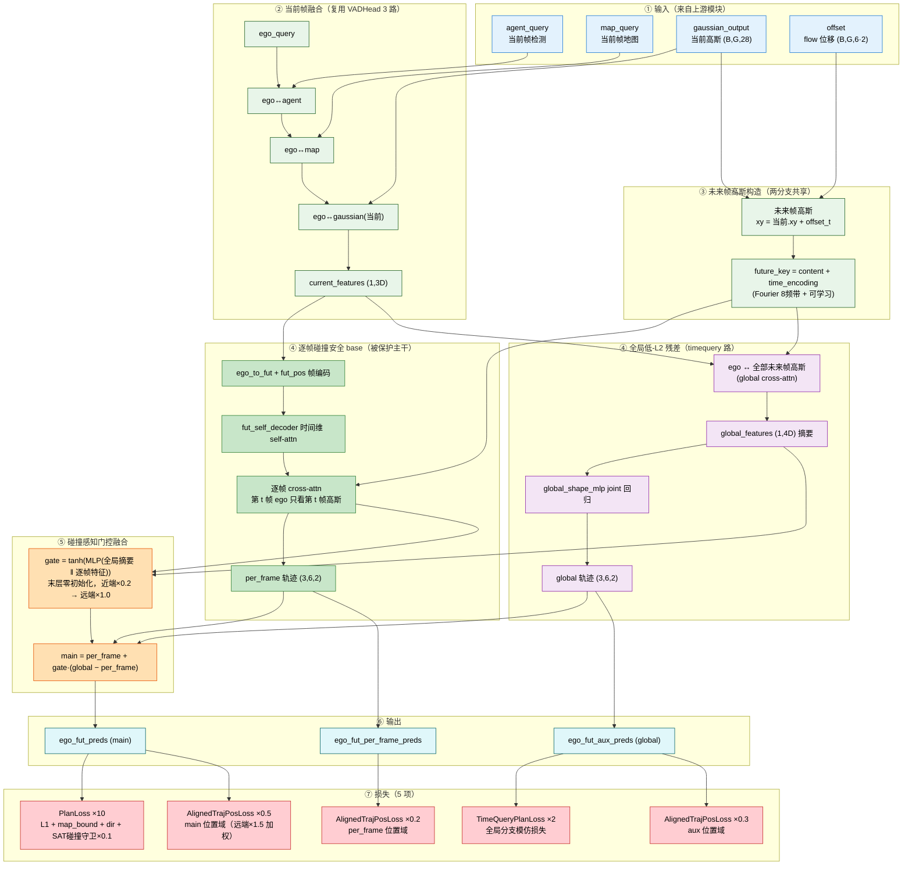

# GaussianAD — Planner 设计演进与实验结果

本文档阐述本仓库 planner（规划头）的设计演进脉络：从基线 `VADHead` 出发，经过多轮引入"未来帧高斯"信息的改造，最终收敛到**融合逐帧碰撞安全与全局低-L2 的门控残差架构 `VADHeadFutAttnGlobalResidual`（planner_v12）**，并给出各变体在 NuScenes 验证集上的规划与占据结果。

---

## 一、设计动机：为什么 planner 需要"未来帧高斯"

原始 `VADHead`（`model/planner/planner.py`）的规划流程是：让 ego query 依次与当前帧的 agent / map / gaussian 三路信息做交叉注意力，拼接成 3D 特征后用 MLP 一次性回归整条未来 6 帧轨迹。这条路线的问题在于：**planner 看不到"未来场景会怎么动"**——未来帧高斯的运动信息（由 temporal encoder 输出的 `offset` flow 位移给出）没有直接参与规划决策。

本项目里未来帧高斯并非重新预测，而是把当前帧高斯按预测位移平移得到（`means_fut = means + offset`，与 `gaussian_head.forward_flow` 同约定）。让未来帧信息进入 planner 的两种互补思路，构成了后续所有变体的两条主线：

- **逐帧路线（碰撞安全）**：ego 逐未来时间步、只与该时刻的未来高斯做交叉注意力，每个 waypoint 都锚定在本帧占据上，碰撞率优秀；
- **全局路线（低 L2）**：ego 一次性对全部未来帧高斯做注意力，联合回归整条轨迹形状，轨迹精度（L2）优秀。

---

## 二、设计演进：五轮改造

### 1. VAD_Planner（接入 planning 的头）

在三维感知（检测 / 占据 / 流）之上首次接入规划头，ego 与当前帧 agent / map / gaussian 交互后回归未来轨迹，作为后续所有实验的基线起点。

### 2. VAD_Planner + Future Gaussian（未来帧高斯第 4 路，planner_v3 `VADHeadFutGaussian`）

把未来帧高斯作为与 agent / map / 当前高斯完全对称的**第 4 路 stream** 融合：未来帧高斯展平成一个 key 集合 `(fut_ts·G, B, D)`，ego 单 query 与全部未来帧高斯做一次交叉注意力，拼接 4D 特征后复用原 `ego_fut_decoder`（输入 3D→4D 加宽）回归轨迹。

设计上保留预训练输出头作基线，属于"增广"而非"替换"；但 key 集合展平后**没有任何时间编码**，模型无法显式区分"这是未来第几帧"。

### 3. futgau_detach_false_time（key 侧时间编码，planner_v4 `VADHeadFutGaussianTime`）

在 v3 基础上做最小改动：给未来帧高斯特征按时间步加上**可学习时间位置编码 `fut_time_pos = nn.Embedding(fut_ts, D)`**，加在 **key/value 侧（高斯特征上）**，使展平后的每个 key 明确携带帧序信息。这是第一版显式引入时间编码的 planner。

### 4. timequery_residual（全局路为主干，planner_v6 `VADHeadTimeQueryResidual`）

把"全局路"作为主干、"辅助路（aux）"作为残差（`main = global + gate·(aux − global)`，`gate` 为可学习标量门 `time_fusion_gate`，末层 tanh 零初始化），并引入**连续 Fourier 时间编码**（多个频带 × 2π·t 相位 + 可学习 Embedding + LayerNorm 融合），对未来帧高斯 key 做更精细的时间建模。该变体拿到最优 L2，但由于主干不是逐帧接地，碰撞率全场最差（0.0201@3s）——**L2 与碰撞不可兼得的典型体现**。

### 5. futattn_global_residual（逐帧路为 base + 全局门控残差，planner_v12，最终版）

**翻转 timequery 的融合方向**，把"逐帧碰撞安全路"作为被保护的主干 base，把"全局低-L2 路"当作门控残差：

$$ \text{main} = \text{per\_frame} + \text{gate} \cdot (\text{global} - \text{per\_frame}) $$

- **per_frame（逐帧 base）**：完全复用 futattn 的逐帧 cross-attn 路——ego 逐未来帧只与该帧未来高斯交互，第 t 帧只看第 t 帧。门未开时（`gate=0`）main 严格等于 per_frame，保证训练起始即碰撞安全。
- **global（全局残差）**：ego 对所有未来帧高斯（带 Fourier+可学习时间编码的 key）做交叉注意力，拼接 4D 全局摘要特征后由 `global_shape_mlp` joint 回归整条轨迹，负责低 L2。
- **gate（碰撞感知融合门）**：逐样本、逐时间步、输入相关的门，`gate = tanh(MLP(global 摘要 ‖ per_frame 接地特征))`，**末层零初始化**（`tanh(0)=0` → 初始 main == per_frame）；再乘时间系数 `time_scale`（近端 0.2 → 远端 1.0），实现"近端压门保碰撞、远端开门拉 L2"。

三条输出分别暴露：`ego_fut_preds`（融合主线）、`ego_fut_aux_preds`（全局分支）、`ego_fut_per_frame_preds`（逐帧基座）。全局分支配独立模仿损失，避免 zero-gate 饿死残差分支的 dead-gate 失效。



---

## 三、损失函数

`futattn_global_residual` 的总损失由 `MultiLoss` 将所有子损失**简单相加**得到（`tot\_loss += loss`，各子损失内部自带权重）。完整组成如下：

$$
\mathcal{L}_{\text{total}} = \underbrace{\mathcal{L}_{occ} + \mathcal{L}_{flow} + \mathcal{L}_{det} + \mathcal{L}_{render} + \mathcal{L}_{dyn} + \mathcal{L}_{phy}}_{\text{① 感知基础损失（×1）}} + \underbrace{\mathcal{L}_{map}}_{\text{② 地图损失}} + \underbrace{10\cdot\big(\mathcal{L}_{l1}+\mathcal{L}_{bound}+\mathcal{L}_{dir}+\mathcal{L}_{col}\big)}_{\text{③ 规划损失 PlanLoss}} + \underbrace{2\cdot\mathcal{L}_{tq} + 0.5\cdot\mathcal{L}_{pos}^{main} + 0.3\cdot\mathcal{L}_{pos}^{aux} + 0.2\cdot\mathcal{L}_{pos}^{per}}_{\text{④ 新增辅助规划损失}}
$$

> 其中 ①②③ 继承自 `ft_plan` 基础配置（不可见改动），④ 为本配置（`futattn_global_residual`）新增。`RenderLoss` 的 `weight=0`，只渲染不参与训练。

---

### ① 感知基础损失（继承自 base，×1）

| 损失 | 公式 | 监督对象 | 作用 |
|------|------|---------|------|
| **OccupancyLoss** `OccupancyLoss` | $$\mathcal{L}_{occ}=10\cdot\text{CE}(\hat s, s_{gt}) + \text{Lov'{a}sz}(\hat s, s_{gt})$$ | 当前帧语义占据（18 类体素） | 让高斯表示还原场景几何+语义，是倒推出"哪里可走/哪里会撞"的第一个前提 |
| **OccupancyFlowLoss** `OccupancyFlowLoss` | $$\mathcal{L}_{flow}=10\cdot\text{CE}(\hat f, f_{gt}) + \text{Lov'{a}sz}(\hat f, f_{gt})$$ | 未来帧占据流动（offset） | 让未来帧占据可被正确预测 → planner 才能"看到未来场景怎么动" |
| **DetectionLoss** `DetectionLoss` | $$\mathcal{L}_{det}=\underbrace{\text{Focal}(\hat y_c, y_c)}_{cls=1.0} + 0.25\cdot\underbrace{\sum_d w_d\,\text{L1}(\hat b_d, b_d)}_{loc=0.25,\, \text{code\_weights}}$$ | 3D 检测框（center/dim/rot/vel） | 给 planner 准确的动态目标（agent 框），碰撞守卫直接复用这些 GT 框 |
| **RenderLoss** `RenderLoss`（weight=0） | $$\mathcal{L}_{render}=5\cdot\text{CE}_{sem}(\hat r) + 0.5\cdot\text{L1}_{depth}(\hat r)$$ | 高斯渲染的语义/深度图（监督信号=0，不参与训练） | 仅保留可视化/诊断，不回传梯度 |
| **DynamicLoss** `DynamicLoss` | $$\mathcal{L}_{dyn}=\text{BCE}_{w/pos}(\hat v, v_{gt}) + 0.5\cdot\text{BCE}_{extra}$$ | 高斯速度场（动态/静态二分类） | 区分动态-静态高斯，只让可移动目标的速度被监督 |
| **PhysicsLoss** `PhysicsLoss` | $$\mathcal{L}_{phy}=\underbrace{1.0\cdot\text{SmoothL1}_{static}}_{\text{static\_w}} + \underbrace{1.0\cdot\text{rigid}}_{\text{rigid\_w}} + \underbrace{4.0\cdot\text{SmoothL1}_{traj}}_{\text{traj\_w}}$$ | 高斯运动的物理合理性（静态惩罚/刚体/真实轨迹跟随） | 约束 offset 满足物理（静态不乱动、刚体不变形、按 GT 轨迹移动） |

> 作用总体：**6 个感知损失把上游感知模块训好，planner 拿到的 agent/map/gaussian/offset 表征才可靠** —— 但它们不直接监督轨迹，是规划质量的前提条件。

---

### ② 地图损失 MapLoss（继承自 ft_plan）

$$
\mathcal{L}_{map} = \underbrace{5.0\cdot\text{PtsL1}(\hat p^{pts}, p_{gt})}_{\text{loss\_pts}} + \underbrace{1.0\cdot\text{SimpleLoss}_{seg}}_{\text{loss\_seg}} + \underbrace{2.0\cdot\text{SimpleLoss}_{pv\_seg}}_{\text{loss\_pv\_seg}} + 0.005\cdot\mathcal{L}_{dir}
$$

- **监督对象**：地图元素（车道线/边界/人行道等）的点、分割、方向。
- **作用**：为 planner 提供高质量地图 token（供 `ego↔map` decoder 交互），并且是下方 PlanLoss 的 `bound`/`dir` 子损失的地图来源——地图不准，压线惩罚与航向监督会误导。

---

### ③ 规划损失 PlanLoss（×10，作用在 fused 主线 `ego_fut_preds`）

$$
\mathcal{L}_{plan} = \underbrace{\mathcal{L}_{l1}}_{\text{L1 位移}} + \underbrace{\mathcal{L}_{bound}}_{\text{车道边界}} + \underbrace{\mathcal{L}_{dir}}_{\text{航向对齐}} + \underbrace{\mathcal{L}_{col}}_{\text{SAT 碰撞守卫}}
$$

#### (1) L1 位移回归 —— 整条轨迹形状的主监督

$$
\mathcal{L}_{l1} = \frac{1}{\sum_t w_t}\sum_t w_t\,\big|\, \Delta\hat{p}_t - \Delta p^{gt}_t \,\big|,\qquad w_t = cmd \cdot \mathbb{1}[\text{mask}_t]
$$

- **监督对象**：逐帧位移 $\Delta\hat p_t$（预测）对 GT 位移（命令模式选中的那条）。
- **作用**：轨迹"形状"主监督，保证整条轨迹贴合 GT —— 直接抑制 L2 误差。

#### (2) 车道边界约束 —— 不压线/不出路

$$
\mathcal{L}_{bound} = \sum_t \max\big(0,\ D_{th} - d_t\big)\cdot\mathbb{1}[d_t \le D_{th}],\qquad d_t = \min_{map}\big|p_t^{cum} - map^{lane}\big|,\ D_{th}=1.0\text{m}
$$

- **监督对象**：累计位置 $p_t^{cum}=\sum_{\tau\le t}\Delta p_\tau$ 到最近车道线的距离（并做线段相交遮罩，已相交帧之后置 0）。
- **作用**：把轨迹压回车道内，**防止轨迹压到路沿/车道边界** → 同时降低 L2 与"地图碰撞"。

#### (3) 航向对齐 —— 方向顺/拐弯贴

$$
\mathcal{L}_{dir} = \frac{1}{2}\sum_t \big|\,\text{yaw}(\hat p_t) - \text{yaw}(\text{lane}_t)\,\big| \cdot \mathbb{1}[d_t\le 2\text{m},\ \text{非静止}]
$$

- **监督对象**：ego 航向角 vs 最近车道的航向角（仅当附近有车道且 ego 非静止）。
- **作用**：让轨迹方向与道路方向一致，直行/转弯都贴合车道 → 减少横向偏移，改进 L2。

#### (4) SAT 碰撞守卫 —— 不撞车（权重 10×0.1=1.0，本配置的安全项）

$$
\mathcal{L}_{col} = \frac{1}{\#(b,t)}\!\sum_{b,t}\!\text{ReLU}\big(\,\underbrace{-\max_{4\,\text{轴}} sep_{b,t}}_{\text{SAT 穿透深度}} + \underbrace{0.5}_{\text{safe\_margin}}\,\big)
$$

- **计算**：把 ego 视为轴对齐矩形、每个 GT agent 视为朝向矩形，用**分离轴定理（SAT）**在 4 条轴（agent 局部 2 轴 + ego 世界 2 轴）上算分离量 $sep$；4 轴全重叠时 $-\max sep$ 即穿透深度。
- **梯度**：ego 累计位置 $\sum\Delta p$ 与每个 agent 的未来足迹（含 yaw 累积）判交，**只对 ego 位置可微**，agent 是固定目标。
- **作用**：把 ego 推出每个 GT agent 的未来足迹 +0.5m 安全边距 —— **碰撞率下降的直接来源**。`col_sat=True` 确保与 `plan_obj_box_col` 指标（轴对齐 ego 矩形 + LiDAR 系 yaw）逐像素对齐。

---

### ④ 新增辅助规划损失（本配置专属，共 4 项）

#### (1) TimeQueryPlanLoss（×2）→ 监督全局分支 `ego_fut_aux_preds`

$$
\mathcal{L}_{tq} = \underbrace{\text{SmoothL1}_{\beta=0.5}\big(\Delta\hat p^{global},\ \Delta p^{gt}\big)}_{\text{位移域}} + 1.0\cdot\underbrace{\text{SmoothL1}_{\beta=0.5}\big(\text{cumsum}(\Delta\hat p^{global}),\ \text{cumsum}(\Delta p^{gt})\big)}_{\text{累积位置域}}
$$

- **监督对象**：裸全局分支（`global_shape_mlp` 输出，未过门控）。
- **作用**：**不依赖门直接监督全局路**，让"低 L2"的全局路即使门是关的也能学到轨迹形状 → 避免"zero-gate 饿死残差分支"的 dead-gate 失效。

#### (2) AlignedTrajectoryPositionLoss（×0.5）→ 监督 fused main `ego_fut_preds`

$$
\mathcal{L}_{pos}^{main}=0.5\cdot\frac{\sum_t w_t^{time}\;\text{SmoothL1}_{\beta=0.5}\big(\text{cumsum}(\hat p^{main})_t,\ \text{cumsum}(p^{gt})_t\big)}{\sum_t w_t^{time}},\qquad w^{time}=(0.5,0.75,1,1,1.25,1.5)
$$

- **监督对象**：融合后的最终轨迹（`ego_fut_preds`）的**累计位置**。
- **作用**：PlanLoss 的 L1 只在**位移**域监督，缺累积位置监督 → 远端（t=5,6）L2 漂移；此项对 cumsum 位置做**远端加重（1s→3s：0.5→1.5）**位置监督，**专补远端绝对位置精度**（不带碰撞惩罚，保住碰撞率）。

#### (3) AlignedTrajectoryPositionLoss（×0.3）→ 监督全局分支位置

$$
\mathcal{L}_{pos}^{aux}=0.3\cdot\underbrace{\frac{\sum_t w_t^{time}\;\text{SmoothL1}\big(\text{cumsum}(\hat p^{aux})_t,\ \text{cumsum}(p^{gt})_t\big)}{\sum_t w_t^{time}}}_{\text{同 (2) 但 pred=aux}}
$$

- **监督对象**：全局分支（`ego_fut_aux_preds`）的累计位置。
- **作用**：在位移域之外约束全局分支的轨迹**形状**，防止全局路被拉向穿障的极端低 L2 形状（门开启帧时尤其关键）。

#### (4) AlignedTrajectoryPositionLoss（×0.2）→ 监督逐帧 base 位置

$$
\mathcal{L}_{pos}^{per}=0.2\cdot\underbrace{\frac{\sum_t w_t^{time}\;\text{SmoothL1}\big(\text{cumsum}(\hat p^{per})_t,\ \text{cumsum}(p^{gt})_t\big)}{\sum_t w_t^{time}}}_{\text{同 (2) 但 pred=per\_frame}}
$$

- **监督对象**：逐帧碰撞安全 base（`ego_fut_per_frame_preds`）的累计位置。
- **作用**：逐帧 base 是门控的"碰撞锚点"（初始 main==per_frame）。给它位置监督保住它的位置精度 → 门开启时全局残差带来的收益才是"锦上添花"而非"带偏"；也防止逐帧 base 精度变差导致门被迫全开。

---

### 监督对象分配总览

```
                    感知网络（6 loss + MapLoss 监督）
                              │
        ┌─────────────────────┴───────────────────────┐
   ego feature (3D)        未来高斯 kv (fut_content)     offset
        │                     │
   ┌────┴────┐          ┌─────┴──────┐
   │per_frame│          │   global   │
   │折叠逐帧路│          │全局 joint 路│
   └────┬────┘          └─────┬──────┘
     per_frame_preds     global_preds (aux)
        │  │                  │
        │  │  TimeQueryPlanLoss (×2) ────► ④(1) 监督 global 位移+位置
        │  │                  │
        │  AlignedPos_aux (×0.3) ────────► ④(3) 监督 global 位置
        │  AlignedPos_per (×0.2) ────────► ④(4) 监督 per_frame 位置
        └──┴── gate 融合 ──► main = per_frame + gate·(global − per_frame)
                     │
              ego_fut_preds
                     │
   PlanLoss (×10) ──► L1(位移) + Bound(车道) + Dir(航向) + SAT碰撞(×0.1)
                     │
   AlignedPos_main (×0.5) ──► ④(2) 监督 fused 累计位置（远端加重）
```

**一句话总结**：感知 6 loss + MapLoss 负责把"场景理解"训好；PlanLoss 在位移/车道/航向/碰撞 4 个域直接约束最终轨迹；新增的 4 项辅助损失按"全局路练形状、逐帧路稳住碰撞、主线补远端位置"的分工，让门控融合的两个分支都被充分监督、各司其职 —— 这是 `futattn_global_residual` 同时压低 L2 与碰撞率的损失侧保障。

## 四、实验结果（NuScenes 验证集，epoch_15）

所有变体共享同一 warm-start（`v12_fixempty/epoch_15`，planner 从头训）、同样 15 轮、`lr=2e-4`，唯一区别是 planner_head 结构。

### 1. 规划指标（L2 越低越好，碰撞率越低越好）

| Model | plan_L2_1s | plan_L2_2s | plan_L2_3s | plan_obj_box_col_1s | plan_obj_box_col_2s | plan_obj_box_col_3s |
|---|---:|---:|---:|---:|---:|---:|
| VAD_base_plan | 0.4662 | 0.8317 | 1.2843 | 0.0133 | 0.0143 | 0.0180 |
| VAD_Planner | 0.5767 | 1.0096 | 1.5115 | 0.0109 | 0.0124 | 0.0187 |
| VAD_Planner+Future Gaussian | 0.5486 | 0.9791 | 1.4967 | 0.0074 | 0.0121 | 0.0168 |
| futgau_detach_false_time | 0.4974 | 0.8811 | 1.3437 | 0.0112 | 0.0127 | 0.0161 |
| timequery_residual | **0.4598** | **0.8066** | **1.2398** | 0.0147 | 0.0168 | 0.0201 |
| dualtime_residual* | 0.5918 | 1.0260 | 1.5421 | **0.0074** | **0.0099** | **0.0155** |
| time_aligned_gaussian* | 0.4722 | 0.8739 | 1.3795 | **0.0080** | **0.0091** | **0.0140** |
| **futattn_global_residual** | 0.4305 | 0.7775 | 1.2156 | 0.0071 | 0.0096 | 0.0130 |

`futattn_global_residual` 同时拿到 **L2 与碰撞率双第一**：L2（0.4305 / 0.7775 / 1.2156）全面优于之前 L2 冠军 `timequery_residual`（0.4598 / 0.8066 / 1.2398），碰撞率（0.0071 / 0.0096 / 0.0130）与之前碰撞冠军 `time_aligned_gaussian*`（0.0080 / 0.0091 / 0.0140）相当甚至更优——验证了"远端开门拉 L2、近端关门保碰撞"的门控设计确实打破了此前 L2 与碰撞不可兼得的权衡。

### 2. 占据指标（mIoU / iou(geo)，越大越好）

| Model | mIoU 0.0s | mIoU 1.0s | mIoU 2.0s | mIoU 3.0s | iou(geo) 0.0s | iou(geo) 1.0s | iou(geo) 2.0s | iou(geo) 3.0s |
|---|---:|---:|---:|---:|---:|---:|---:|---:|
| VAD_base_plan | 14.09 | 10.32 | 7.51 | 5.64 | 29.76 | 24.13 | 19.66 | 15.95 |
| VAD_Planner | 18.97 | 13.28 | 9.19 | 6.63 | 31.75 | 25.01 | 19.07 | 15.25 |
| VAD_Planner+Future Gaussian | 19.31 | 13.49 | 9.33 | 6.69 | 31.93 | 25.04 | 19.09 | 15.27 |
| futgau_detach_false_time | 18.81 | 12.82 | 9.16 | 6.57 | 32.06 | 25.18 | 19.84 | 15.46 |
| timequery_residual | 18.31 | 13.07 | 9.27 | 6.75 | 31.10 | 24.43 | 18.63 | 14.93 |
| dualtime_residual* | 19.25 | 13.39 | 9.36 | 6.76 | 31.88 | 24.91 | 19.13 | 15.45 |
| time_aligned_gaussian* | 19.60 | 13.49 | 9.26 | 6.63 | 31.57 | 24.42 | 18.54 | 14.79 |
| futattn_global_residual | 17.83 | 12.72 | 8.91 | 6.44 | 30.43 | 23.68 | 18.00 | 14.35 |

`futattn_global_residual` 只替换了 planner_head（新增残差分支），没有改动任何占据 / flow 相关模块，因此其 mIoU / iou(geo) 与各对照相当（0.0s mIoU 17.83 属正常波动）。planner 改动的主要收益体现在规划指标本身，并通过 `use_plan_ego` 把更优的自车轨迹用于 occ_flow 的 ego 补偿，间接提升未来帧一致的相对关系。

---

## 五、结论

从 `VADHead` 到 `futattn_global_residual` 的演进核心是**把"未来帧高斯"接入规划、并为时间维度建模**：先是作为第 4 路信息融合（v3）→ 补 key 侧可学习时间编码（v4）→ 全局路主干 + 连续 Fourier 时间编码（timequery）→ 最终翻转融合方向，以逐帧碰撞安全路为被保护主干、全局低-L2 路为门控残差（v12，本次实验）。门控的零初始化与近端限流让模型在训练起始即碰撞安全，并在可信帧逐渐放开全局摘要，最终在 L2 与碰撞率上同时取得最优，达到"鱼与熊掌兼得"。
