# GaussianAD 模型结构解析

> 本文档系统梳理 `model/` 目录下整个模型从**输入数据**到**多任务输出**的完整结构。
> 先给出**整体架构图**，再对每个模块单独给出**数据输入 / 输出的 mermaid 子图**并逐段解析其作用。
>
> 关键超参（来自 `config/nuscenes_gs25600.py`）：
> - 时序帧数 `F = 4`（3 历史帧 + 1 当前帧），相机数 `N = 6`
> - 高斯 anchor 数 `num_anchor = 25600`，特征维度 `embed_dims = 128`
> - 语义类别 `semantic_dim = 17`，占用类别含 empty 共 18 类
> - 感知范围 `pc_range = [-30, -30, -2, 30, 30, 2]`，体素 `voxel_size = 0.5 m`
> - 单个 anchor 通道 = 3(xyz) + 3(scale) + 4(rot) + 1(opacity) + 17(semantic) + 12(offset) = **40**

---

## 1. 整体架构

模型主体是 `BEVSegmentor`（`model/segmentor/bev_segmentor.py`），
它把「环视图像」提升为一组 **3D 高斯（Gaussian）** 表示，再由多个任务头解码为
占用（Occupancy）、检测（Detection）、地图（Map）、规划（Planning）等输出。

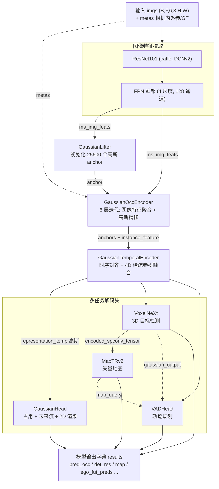

**数据主线（`BEVSegmentor.forward`）：**
1. `extract_img_feat` → 图像多尺度特征 `ms_img_feats`
2. `lifter` → 高斯 anchor（`representation`）
3. `encoder` → 单帧内迭代精修高斯
4. `temporal_encoder` → 跨帧时序融合，得到当前帧高斯 `representation_temp`
5. `decoder`（VoxelNeXt）→ 3D 检测，同时产出共享的 `encoded_spconv_tensor`
6. `map_decoder`（MapTRv2）→ 复用稀疏体素特征解码矢量地图
7. `planner_head`（VADHead）→ 融合 agent / map / gaussian 上下文预测自车轨迹
8. `head`（GaussianHead）→ 占用语义、未来占用流、（训练时）2D 伪标签渲染

---

## 2. 输入数据

`Dataset.__getitem__` 返回给模型的核心张量与元信息：

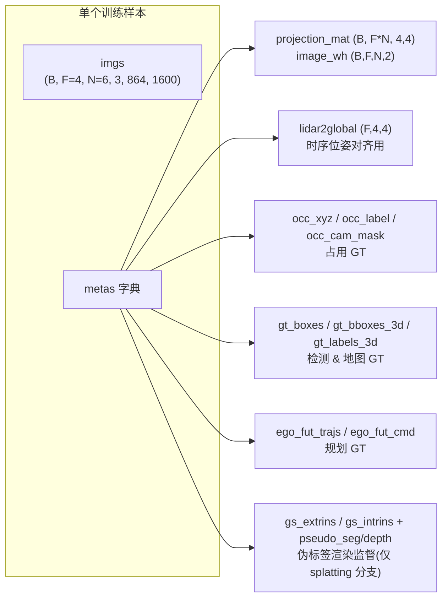

- **imgs**：环视 6 相机、4 帧时序图像。进入 backbone 前会被展平为 `(B*F*N, 3, H, W)`。
- **projection_mat / image_wh**：把 3D 高斯关键点投影回各相机像素平面，供 `DeformableFeatureAggregation` 采样图像特征。
- **lidar2global**：时序编码器用来把历史帧高斯 warp 到当前帧坐标系。
- **occ_* / gt_* / ego_***：分别是占用、检测/地图、规划任务的监督信号，仅在 loss 阶段使用。

---

## 3. 图像特征提取（ResNet101 + FPN）

代码：`BEVSegmentor.extract_img_feat` / `_run_img_backbone_flat`

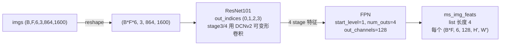

**作用**：将高分辨率图像编码为**多尺度语义特征金字塔**，为后续高斯的图像特征聚合提供不同感受野的视觉线索。
- ResNet101 采用 caffe 风格、`frozen_stages=1`、`norm_eval=True`（冻结 BN），后两个 stage 使用 DCNv2 增强几何形变适应性。
- 训练时可开启 `history_no_grad`：历史帧 backbone 在 `torch.no_grad()` 下前向，只有当前帧参与梯度，节省显存与反向时间。

---

## 4. GaussianLifter（高斯初始化）

代码：`model/lifter/gaussian_lifter.py`

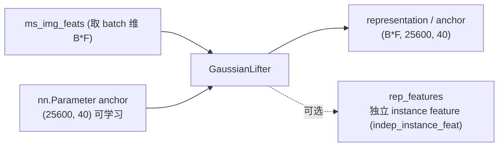

**作用**：生成一组**与场景无关、可学习的高斯 anchor** 作为解码起点。每个 anchor 是一个 40 维向量：

| 分量 | 维度 | 含义 |
|------|------|------|
| xyz | 3 | 3D 位置（经 inverse-sigmoid 编码） |
| scale | 3 | 三轴缩放 |
| rotation | 4 | 四元数 |
| opacity | 1 | 不透明度 |
| semantic | 17 | 语义 logits |
| offset | 12 | 未来 6 步 xy 位移（运动流）|

- 默认模式：`self.anchor` 是形状 `(25600, 40)` 的可学习参数，前向时沿 batch 维平铺为 `(B*F, 25600, 40)`。
- 可选 `pts_init`：用伪深度反投影点云动态初始化 xyz；`indep_instance_feat`：额外提供解耦的 query 特征。

---

## 5. GaussianOccEncoder（单帧高斯精修）

代码：`model/encoder/gaussian_encoder/gaussian_encoder.py`

这是模型的核心：以 `operation_order` 定义的算子序列，**迭代 6 层**（1 单帧层 + 5 带 spconv 层），
反复「从图像采样特征 → 更新高斯」。

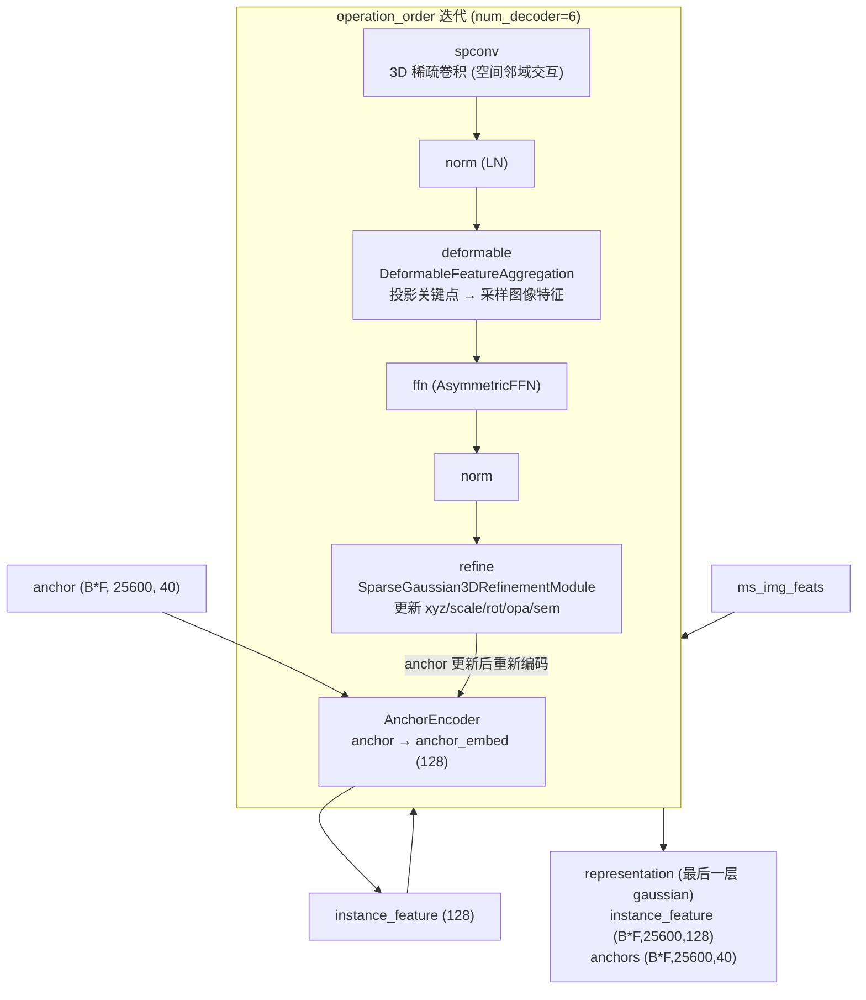

**各子模块作用：**

### 5.1 SparseGaussian3DEncoder（AnchorEncoder）
把 40 维 anchor 几何参数编码为 128 维 `anchor_embed`，作为 query 特征的几何先验；每层 refine 后 anchor 变化都会重新编码。

### 5.2 DeformableFeatureAggregation（deformable）
代码：`deformable_module.py`

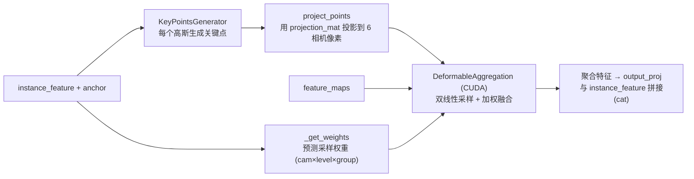

作用：把每个 3D 高斯投影到六个相机，从多尺度特征图上**可变形采样**并按学习权重融合，
使高斯特征获得对应图像区域的视觉信息。

### 5.3 SparseGaussian3DRefinementModule（refine）
代码：`refine_module.py`

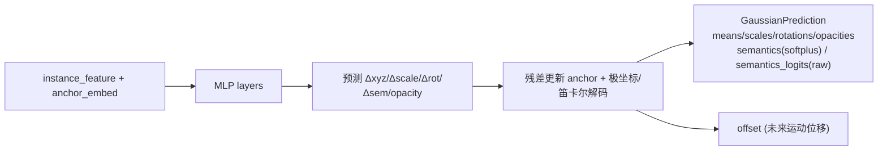

作用：根据聚合后的特征**回归高斯参数增量**并残差更新，输出结构化的 `GaussianPrediction`。
注意它同时保留 `semantics`（softplus 激活，供 3D 占用渲染）和 `semantics_logits`（原始 logits，供 2D gsplat 渲染）。

### 5.4 SparseConv3DBlock（spconv）
把当前高斯体素化后做 3D 稀疏卷积，实现**高斯之间的空间邻域信息交互**（单帧层不含此算子）。

---

## 6. GaussianTemporalEncoder（时序融合）

代码：`model/encoder/temporal_encoder/gaussian_temporal_encoder.py`

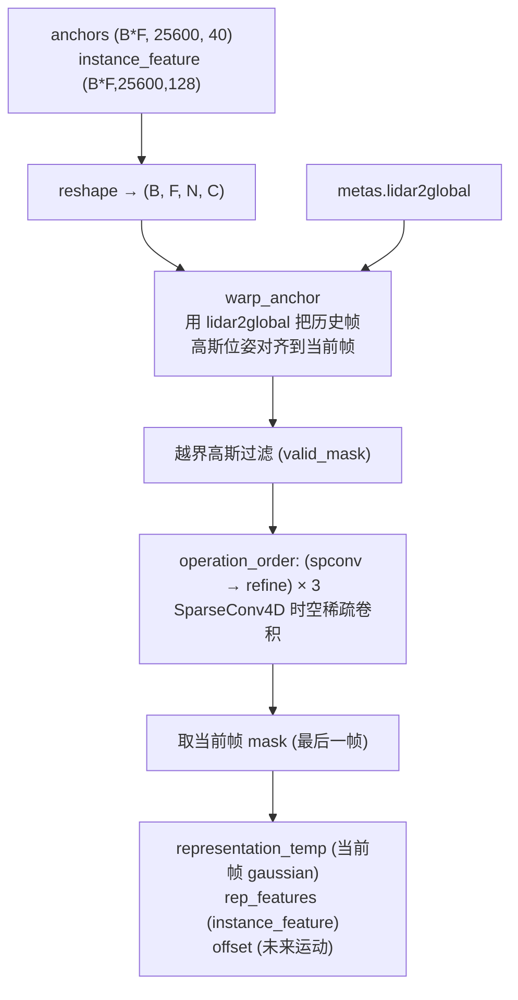

**作用**：把 4 帧独立精修后的高斯**在几何上对齐并时空融合**。
- `warp_anchor`：用 `prev2cur = inv(lidar2global[cur]) · lidar2global[prev]` 将各历史帧高斯坐标搬到当前帧。
- `SparseConv4D`：在 `(帧, x, y, z)` 四维稀疏网格上卷积，聚合跨帧运动/一致性信息。
- 最后一层 refine 用 `mask` 只保留**当前帧**高斯，作为下游所有任务头的统一 3D 表示 `representation_temp`，同时输出 `offset` 供未来占用流。

---

## 7. GaussianHead（占用 + 未来流 + 渲染）

代码：`model/head/gaussian_head.py`

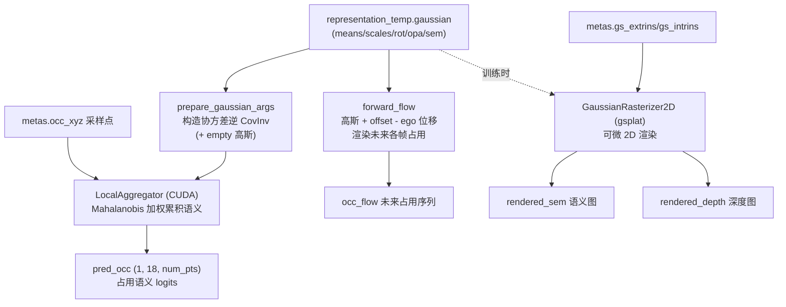

**作用**：把连续的 3D 高斯「泼溅」到查询点/像素上，生成可监督的稠密输出。
- **LocalAggregator**：对每个采样点，用 `weight = opacity · exp(-0.5·dᵀ·CovInv·d)`（Mahalanobis 距离）加权累积各高斯语义，得到 3D 占用语义 → `OccupancyLoss`。
- **forward_flow**：以 `当前高斯 + offset - 自车运动` 构建未来帧高斯并渲染未来占用 → `OccupancyFlowLoss`。
- **GaussianRasterizer2D**（仅训练、splatting 分支）：用 gsplat 把高斯的 `semantics_logits` / 深度可微渲染到 6 相机平面，与伪标签（Grounded-SAM 语义、Metric3D 深度）计算 `RenderLoss`。推理时跳过，输出 None。

---

## 8. VoxelNeXt（3D 目标检测解码）

代码：`model/detectors/voxelnext.py`

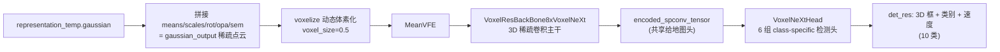

**作用**：把高斯当作稀疏点云，经 VoxelNeXt 稀疏 3D 主干与稀疏检测头，输出 10 类 3D 目标框
（center/center_z/dim/rot/vel）→ `DetectionLoss`（FocalLoss 分类 + L1 回归）。
其中间产物 `encoded_spconv_tensor` 被**地图头复用**，避免重复构建 BEV 特征。

---

## 9. MapTRv2（矢量地图解码）

代码：`model/detectors/maptrv2.py` + `model/dense_heads/maptrv2_head.py`

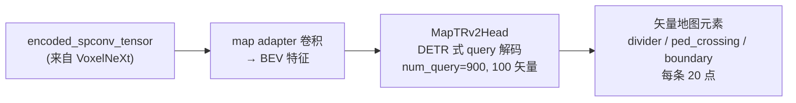

**作用**：复用检测分支的稀疏体素特征，经地图适配卷积转成 BEV 特征后，用 MapTRv2 的
DETR 式点集 query 解码出**矢量化高精地图**（3 类地图元素，每条折线 20 点）→ `MapLoss`
（分类 FocalLoss + 点集 L1 + 方向余弦 + 分割）。

---

## 10. VADHead（轨迹规划）

代码：`model/planner/planner.py`（原始 VAD-style planner，三路解码器 + 一路 MLP 规划头）

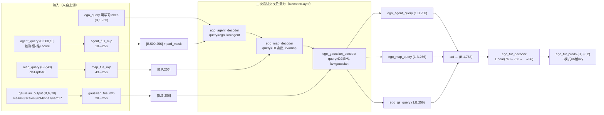

---

形状变化总览：

| 模块 | 输入形状 | 输出形状 |
|------|----------|----------|
| `agent_fus_mlp` | `[B,500,10]`（框8维+score1） | `[B,500,256]` |
| `map_fus_mlp` | `[B,P,43]`（cls1 + 20点×2） | `[B,P,256]` |
| `gaussian_fus_mlp` | `[B,G,28]`（G=25600 高斯） | `[B,G,256]` |
| `ego_agent_decoder` | q:`[1,B,256]` kv:`[500,B,256]` | `[1,B,256]` |
| `ego_map_decoder` | q:`[1,B,256]` kv:`[P,B,256]` | `[1,B,256]` |
| `ego_gaussian_decoder` | q:`[1,B,256]` kv:`[G,B,256]` | `[1,B,256]` |
| cat + `ego_fut_decoder` | `[B,1,768]` | `[B,36]` → `[B,3,6,2]` |

**说明**：自车以可学习 token `ego_query` 为 query，依次与 agent（检测）、map（地图）、
gaussian（3D 占用高斯，G=25600）三路上下文交叉注意力；解码后的三路 ego 特征拼接成 768 维，
由 MLP 回归**多模态自车轨迹**（3 种驾驶意图 × 未来 6 步 × xy）→ `PlanLoss`。gaussian
这一路正是本项目相对原版 VAD 的扩展：利用 3DGS 表示的空间感知能力作为规划上下文。

## 11. 输出与 Loss 汇总

`BEVSegmentor.forward` 最终返回一个 `results` 字典，交给 `MultiLoss` 分发到各子 loss：

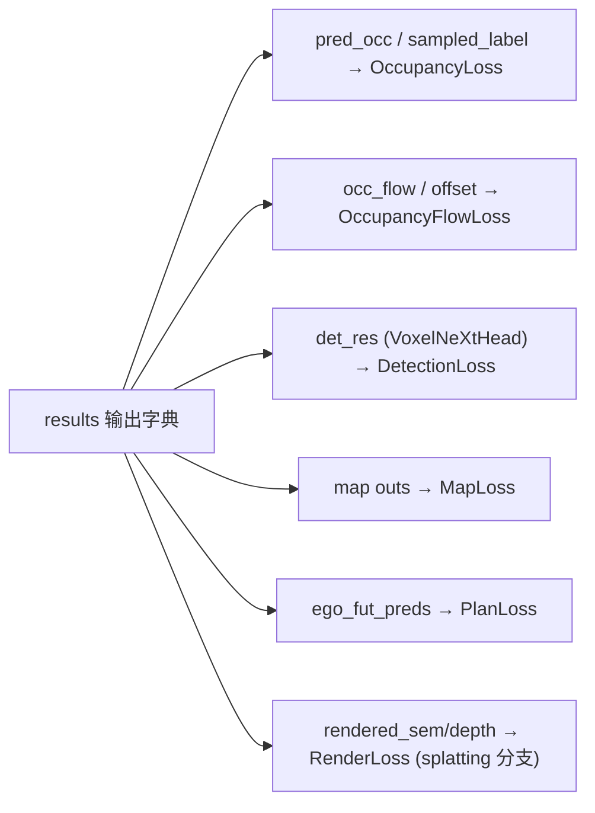

| Loss | 监督对象 | 来源模块 |
|------|----------|----------|
| OccupancyLoss | 3D 占用语义 | GaussianHead / LocalAggregator |
| OccupancyFlowLoss | 未来占用流 | GaussianHead.forward_flow |
| DetectionLoss | 3D 目标框 | VoxelNeXt |
| MapLoss | 矢量地图 | MapTRv2 |
| PlanLoss | 自车轨迹 | VADHead |
| RenderLoss | 伪标签语义+深度 | GaussianRasterizer2D（仅训练） |

> 推理时 `head` 只走 3D 占用路径（LocalAggregator），2D 渲染分支输出 None，不影响评测。
